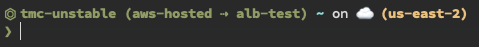

> **⚠️ Archived 2025-08-21. No longer maintained.**

# tmc-prompt

A script that lets you add the current VMware Tanzu Mission Control (TMC) context, management cluster and provisioner to your Bash prompt.

Currently supporting [Starship](https://starship.rs/) as well as your generic $PS1.



[](https://asciinema.org/a/1aW05S2GjC89WsRfMLh0l8uNc)

Inspired by the super useful [kube-ps1](https://github.com/jonmosco/kube-ps1)

## Installing
1. Make sure you have the `tmc` CLI installed.
2. Clone this repository
3. Source [tmc_prompt.sh](tmc_prompt.sh), e.g `. /path/to/tmc_prompt.sh`. You can also source this script from your Bash runcom, e.g. `~/bashrc` to persist the prompt across bash sessions and add any of the configuration overides explained below.
4. Run `tmc_configure_prompt` to install the prompt

### Starship prompt framework
`tmc_configure_prompt` shows or installs a custom prompt for TMC. Any further overrides can be performed in `~/.config/starship.toml` as described in [the Starship documentation](https://starship.rs/config/#custom-commands).

### Generic Bash prompt
Even if you're just using the basic Bash prompt, `tmc_configure_prompt` can update your `$PROMPT_COMMAND` environment variable and provide a helper function to toggle the visibility of the TMC prompt.

Of course, you can also simply source [tmc_prompt.sh](tmc_prompt.sh) and set `$PS1`
```shell
source /path/to/tmc_prompt.sh
export PS1=tmc_prompt
```

## Helper functions
Sourcing [tmc_prompt.sh](tmc_prompt.sh) provides the following functions
| Function Name | Use |
| :------- | ------- |
| tmc_defaults | Toggles the visibility of the TMC defaults in the prompt string using args `on` or `off` |
| tmc_prompt | Displays the TMC prompt or, when used with args `on` or `off`, toggles the visibility of the TMC prompt |
| tmc_configure_prompt | Configure the TMC prompt for the supported prompt implementation |

Executing [tmc_prompt.sh](tmc_prompt.sh) directly will echo the TMC prompt string.

## Options
There are some options to override the construction of the prompt.

### Prompt format
The TMC prompt format is defined using the following tokens
| Token | Meaning |
| :------- | ------- |
| `#CONTEXT#` | Current TMC context |
| `#DEFAULTS#` | Current TMC defaults |
| `#MGMT_CLUSTER#` | Default management cluster |
| `#PROVISIONER#` | Default provisioner |

The default settings can be overridden by setting the following environment variables:

| Variable | Default | Meaning |
| :------- | :------ | ------- |
| `TMC_PROMPT_FORMAT` | `⏣ #CONTEXT# #DEFAULTS#` | Default prompt format |
| `TMC_PROMPT_DEFAULTS_FORMAT` | `(#MGMT_CLUSTER# ⇢ #PROVISIONER#)` | Format of TMC defaults in the prompt |

### Toggling the visibility of the TMC defaults
Use `tmc_defaults on` to display the TMC defaults and `tmc_defaults off` to hide them.

### Toggling the visibility of the TMC prompt
Use `tmc_prompt on` to make the TMC prompt visible and `tmc_prompt off` to hide it.

## Other Tanzu Mission Control CLI stuff
You can use [the tmctx, tmcmc and tmcp utilites](https://github.com/ali5ter/tmcctx) to help switch between TMC CLI contexts, management clusters and provisioners.

If you're curious about the TMC CLI and looking for examples, take a look at [my scripts I use to understand the usability and functionality of the TMC CLI](https://github.com/ali5ter/vmware_scripts/tree/master/tmc).

Also, if you're at all interested in CLI taxonomy, check out [cli_taxo](https://github.com/ali5ter/cli_taxo).
